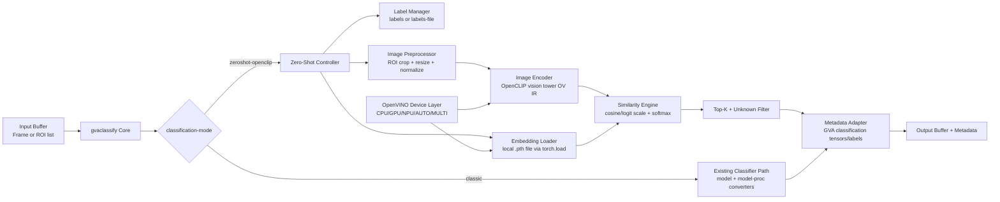

# High-Level Design: gvaclassify Zero-Shot Classification with OpenCLIP

## 1. Overview

This document proposes an enhancement to `gvaclassify` to support zero-shot image
classification using OpenCLIP models, with OpenVINO execution on CPU, GPU, and NPU.

The goal is to enable a production-ready pipeline for scenarios similar to:

- vision-checkout-openclip: dynamic retail SKU classification without retraining
- zero-shot-image-classification-npu: OpenVINO-based zero-shot execution on Intel NPU

The enhancement should preserve existing `gvaclassify` behavior for non-zero-shot
models while adding a new operational mode for embedding-driven zero-shot classification.

## 2. Goals and Non-Goals

### Goals

- Add a zero-shot mode to `gvaclassify` that supports OpenCLIP models.
- Support execution on `CPU`, `GPU`, `NPU`, `AUTO`, and `MULTI:*` devices through OpenVINO.
- Support ROI-list and full-frame classification flows.
- Keep end-to-end latency predictable by loading precomputed label embeddings.
- Keep backward compatibility with current `gvaclassify` properties and metadata output.

### Non-Goals

- No retraining or fine-tuning flow in `gvaclassify`.
- No requirement for online model download in runtime path.
- No replacement of existing classification converters for classic closed-set models.

## 3. Functional Requirements

- Accept label set from existing `labels` and `labels-file` properties.
- Load precomputed zero-shot label embeddings from a local `.pth` file.
- Run image encoder inference per ROI/frame and compute similarity against class prototypes.
- Emit ranked class scores with confidence and keep compatibility with current metadata readers.
- Allow unknown classification thresholding for low-confidence predictions.
- Support static-shape execution profiles required by NPU.

## 4. Proposed Architecture

The design introduces a dedicated zero-shot path inside `gvaclassify` while reusing
existing scheduling, batching, and metadata plumbing in base inference components.



## 5. Component Design

### 5.1 Zero-Shot Controller

Responsibilities:

- Resolve runtime mode (`classic` vs `zeroshot-openclip`).
- Validate required properties for zero-shot mode.
- Load precomputed label embeddings from `.pth`, then orchestrate image inference and similarity computation.

Integration point:

- Extend `gvaclassify` internal processing branch after ROI selection and before
  existing output conversion.

### 5.2 Label and Embedding Asset Manager

Responsibilities:

- Load label candidates from `labels`/`labels-file`.
- Load class embedding matrix from local `.pth` file via `torch.load`.
- Validate embedding dimension and class count consistency against configured labels.

Expected `.pth` payload (example):

- Tensor shape `[num_classes, embedding_dim]` with class rows aligned to label order.

### 5.3 Encoder Subsystem

Runtime uses the vision tower only:

- Vision encoder: executed per ROI/frame.

Text-side processing is out of pipeline scope:

- Label embeddings are generated offline and provided as a local `.pth` artifact.

Implementation options:

- Option A (preferred): load OpenVINO vision encoder in `gvaclassify` and load
  precomputed `.pth` label embeddings with `torch.load`.
- Option B: add support for additional serialized embedding formats later if needed.

### 5.4 Embedding Load and Lifetime

Load scope:

- Load once at startup from local `.pth`.
- Keep loaded embedding matrix in memory during pipeline lifetime.

Validation key example:

- `model_id + embedding_file_hash + labels_hash + embedding_dim`

Cached object:

- L2-normalized class embedding matrix `E_text` loaded from `.pth`.

### 5.5 Similarity and Post-Processing

Pipeline:

1. L2-normalize image embedding `e_img`.
2. Compute logits `logits = scale * (e_img dot E_text)`.
3. Softmax to probabilities.
4. Select top-K classes.
5. Apply optional `unknown-threshold` rule.

## 6. Backend Strategy (CPU, GPU, NPU)

### 6.1 Device Selection

Reuse existing `device` property in `gvaclassify`:

- Direct: `CPU`, `GPU`, `NPU`
- Aggregated: `AUTO`, `MULTI:GPU,NPU,CPU`

### 6.2 Shape Profiles and NPU Constraints

- NPU path should use static input shapes for the vision encoder.
- Provide predefined shape profiles per model family, for example:
  - Vision input: `1x3x378x378` (DFN5B ViT-H-14-378)
- Disallow unsupported dynamic reshapes on NPU with clear startup error messages.

### 6.3 Precision and Performance Profiles

Recommended default profiles:

- CPU: FP16/FP32, throughput streams configurable via `ie-config`.
- GPU: FP16, VA surface sharing where applicable for ROI pipeline efficiency.
- NPU: static shape profile, precision per supported OpenVINO/NPU plugin capability.

## 7. API and Property Extensions (Proposed)

Existing properties remain valid. Add the following optional properties:

- `classification-mode` (string, default: `classic`)
  - values: `classic`, `zeroshot-openclip`
- `zeroshot-model-id` (string)
  - HF/OpenCLIP model identifier or local exported model ID
- `zeroshot-model-dir` (string)
  - path to the exported vision-model assets used for runtime image encoding
- `zeroshot-embeddings-file` (string, required for `classification-mode=zeroshot-openclip`)
  - absolute path to local `.pth` file containing precomputed class embeddings. Loaded at startup with `torch.load`.
- `zeroshot-topk` (uint, optional)
  - optional cap on how many ranked classes `gvaclassify` emits in its interpreted metadata. If omitted, the element may keep the full ranking and downstream JSON consumers can choose how much to retain.
- `unknown-threshold` (float, default: disabled)
  - if top-1 confidence is below threshold, mark as unknown

## 8. Metadata Contract

Maintain compatibility with current metadata consumers:

- Continue attaching standard classification metadata objects to ROI/frame.
- Include top-1 as primary class and, when requested, preserve the ranked score tensor in the output payload.
- Preserve existing behavior of `skip-raw-tensors` so consumers can decide whether they want compact metadata or full ranking data.

Optional extension:

- Add zero-shot specific metadata fields as extra keys without breaking old readers:
  - `zs_mode=true`
  - `zs_model=<id>`
  - `zs_unknown=<bool>`

## 9. Error Handling and Fallbacks

Startup validation:

- Missing model assets, missing/invalid `.pth` embedding file, empty labels, unsupported device/profile.

Runtime handling:

- If `.pth` loading fails (`torch.load` error), fail fast with actionable diagnostics.
- If selected device cannot compile model, fail fast with actionable diagnostics.

Fallback policy:

- If `AUTO/MULTI` fails one target, allow OpenVINO to choose available target.
- Do not silently fall back from `zeroshot-openclip` to `classic` mode.

## 10. Performance Considerations

- Do not perform text encoding in pipeline.
- Load embeddings once at startup; reload only after explicit property change or pipeline restart.
- Reuse compiled models via `model-instance-id` where practical.
- Keep preprocessing on accelerator-friendly memory paths (`va`/`va-surface-sharing`) when available.

## 11. Security and Operational Considerations

- Treat label file and `.pth` embedding input as untrusted assets.
- Bound max number of labels and enforce maximum embedding tensor size to avoid unbounded memory usage.
- Log model IDs, device choice, and embedding load success/failure counters for observability.

## 12. Validation Plan

### Functional

- Unit tests for `.pth` loading, label-to-row alignment checks, similarity computation, and unknown threshold logic.
- Integration tests for ROI-list and full-frame pipelines.

### Backend

- Execute test matrix on `CPU`, `GPU`, and `NPU` with at least one shared model family.
- Validate startup failure paths for unsupported profiles and malformed configs.

### Performance

- Measure startup latency for `.pth` load and steady-state inference latency.
- Measure per-frame latency and throughput under single-stream and multi-stream pipelines.

## 13. Rollout Plan

1. Phase 1: Internal feature flag, CPU functional baseline.
2. Phase 2: GPU backend tuning and memory-path optimization.
3. Phase 3: NPU static-shape profile support and validation.
4. Phase 4: Public docs, samples, and CI coverage.

## 14. Example Pipeline Snippets (Target UX)

Single-stage zero-shot classification:

```bash
gst-launch-1.0 filesrc location=input.mp4 ! parsebin ! vah264dec ! \
"video/x-raw(memory:VAMemory)" ! \
gvaclassify classification-mode=zeroshot-openclip \
  zeroshot-model-dir=/models/clip_dfn5b_ov \
  zeroshot-embeddings-file=/models/labels_embeddings.pth \
  labels-file=/models/labels.txt \
  unknown-threshold=40 \
  device=NPU pre-process-backend=va ! \
queue ! gvametaconvert format=json add-tensor-data=true ! gvametapublish ! fakesink
```

Two-stage detect + zero-shot classify:

```bash
gst-launch-1.0 filesrc location=input.mp4 ! parsebin ! vah264dec ! \
"video/x-raw(memory:VAMemory)" ! \
gvadetect model=/models/detector.xml device=GPU pre-process-backend=va ! queue ! \
gvaclassify classification-mode=zeroshot-openclip \
  zeroshot-model-dir=/models/clip_dfn5b_ov \
  zeroshot-embeddings-file=/models/products_embeddings.pth \
  labels-file=/models/products.txt \
  device=MULTI:GPU,NPU,CPU pre-process-backend=va ! \
queue ! gvawatermark ! autovideosink
```

## 15. Open Questions

- Should `zeroshot-embeddings-file` support additional formats beyond `.pth` (for example `.npy`/`.npz`)?
- Should the embedding file be required to carry labels internally, or remain external via `labels`/`labels-file`?

## 16. References

- `docs/user-guide/elements/gvaclassify.md`
- `docs/user-guide/dev_guide/performance_guide.md`
- vision-checkout-openclip (reference application for OpenCLIP + OpenVINO zero-shot flow)
- zero-shot-image-classification-npu (reference for static-shape NPU execution)
